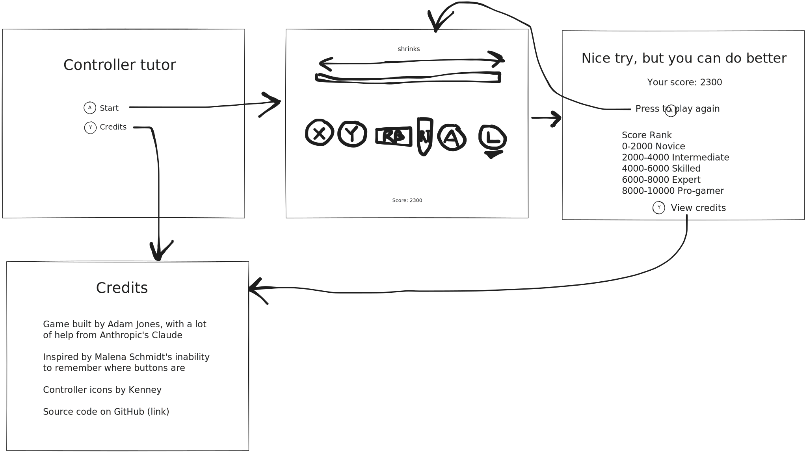

# controller-tutor [(view live)](https://adamjones.me/controller-tutor/)

A web game to learn where the buttons on an Xbox controller are

https://github.com/user-attachments/assets/3cfbe215-8dae-40f2-a3f5-bcb87d9b3336

## Wireframe

Before building anything, I planned out the UI:

The final product does look fairly similar to what I envisioned!

## Contributing

Pull requests are welcomed on GitHub! To get started:

1. Install Git and Node.js
2. Clone the repository
3. Install dependencies with `npm install`
4. Run the app with `npm start`
5. Run `npm run test` to run tests
6. Build with `npm run build`

## Releases

Commits to the master branch are automatically published to GitHub Pages.
